class: full-page, slide-intro
# Anatomie d'un JPG
---
class: content-centered
# Pourquoi parler de JPEG ?
- la Web perf est un sujet d'actualité
- le JPEG est massivement utilisé
- ... bien qu'il date du début des années 90
- ... et qu'il est parfois incompris ou mal utilisé
---
class: content-centered
# JPEG : historique
- **J**oint **P**hotographic **E**xperts **G**roup produced the standard *Information technology – Digital compression and coding of continuous-tone still images*
- Le groupe a démarré 1986, le standard a été publié en 1992 (apprové par l'ISO et l'ITU)
- Méthode de compression d'image
- Format de fichier associé : **J**peg **F**ile **I**nterchange **F**ormat (JFIF)

---
class: content-centered
# Images : >50% du payload
.center[
  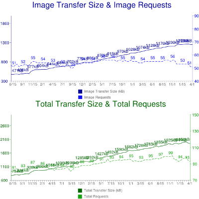

  [HTTP Archive (2011-2015)](http://httparchive.org/trends.php?s=All&minlabel=Jun+1+2011&maxlabel=Apr+1+2015#bytesImg&reqImg)
]

---
class: content-centered
# Sommaire

- Fonctionnement de la compression JPEG
- Metadatas
- Outils utiles

---
class: content-centered
# Que se cache-t-il derrière ?
.center[
  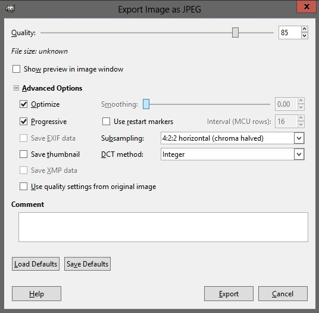
]

---
class: content-centered
# Vision naïve

.center[
  
]

 

- 400 x 268 = 107 200px
- RGB = 3 bytes
- 321 600 ≠ 111 858 ≠ 9 412

---
class: content-centered
# Une combinaison de méthodes

### Compression sans perte (lossless)
- Techniques issues de la théorie de l'information 
- Algèbre linéaire

### Compression avec perte (lossy)
- Techniques psychovisuelles
- Quantification

---
class: content-centered
# Division par blocs de 8x8

.center[
  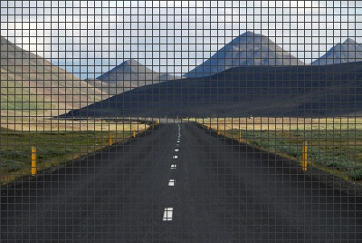
]

- Compression par bloc de 64 pixels (Minimum Coded Unit)
- Artefacts visibles à l'œil nu
- Chaque MCU est considérée comme un vecteur de taille 64 ordonné en zig-zag

---
class: content-centered
# Division par blocs de 8x8
.column-left[
  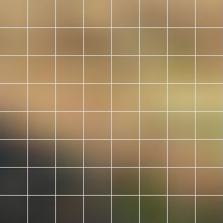
]
.column-right[
  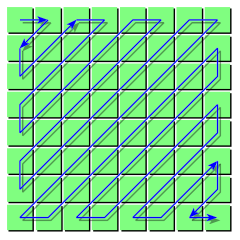
]

- 8x8 c'est petit avec les résolutions actuelles
- Redondance de teinte entre les blocs voisins
- [Bon compromis](http://www.faqs.org/faqs/mpeg-faq/part3/) de taille entre localité et performances (à l'époque)

---
class: content-centered
# Encodage et décodage

.center[
  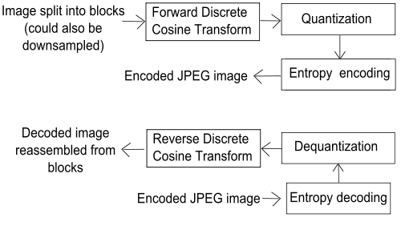
]

- Temps de traitement et optimisations sur l'encodeur
- Décodeur plutôt rapide et standardisé

---
class: content-centered
# Changement de perspective
.center[
  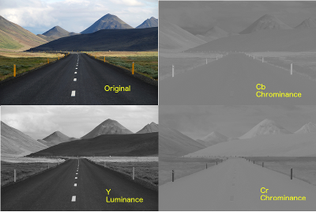
]

- **RGB ➔ YCbCr** (Luminance et chrominance)
- Changement de base dans l'espace vectoriel des MCU
- Lossless (tant qu'on arrondit pas)
- L'œil humain est bien plus sensible à la luminance 

---
class: content-centered
# Subsampling en chrominance
.center[
  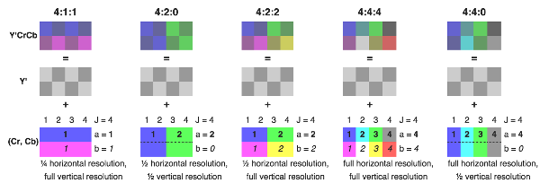
]

- Reduction de la chrominance moins bien perçue par l'œil humain
- Méthode lossy du [chroma subsampling](http://en.wikipedia.org/wiki/Chroma_subsampling)
- Symboles abscons (4:4:4, 4:2:2, 4:4:0...) connus aussi en vidéo

---
class: content-centered
# Discrete Cosine Transform

.column-left[
- Sur chaque composant (Y, Cb, Cr) de chaque MCU
- Dur à expliquer, partie la plus coûteuse en CPU
- Permet de décomposer sur une base de fréquences spatiales
]
.column-right[
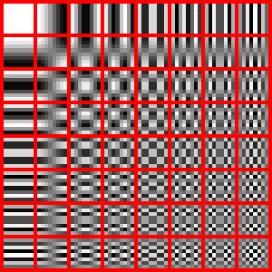
]

---
class: content-centered
# DCT côté maths
.column-right[
 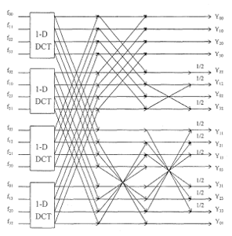
]


- Proche de la Discrete Fourier Transform (connu et optimisé)
- Bonne approximation de la [Karhunen-Loève Transform](http://en.wikipedia.org/wiki/Karhunen%E2%80%93Lo%C3%A8ve_theorem) ou ACP
- Pour les processus markoviens stationnaires d'ordre 1
  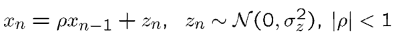
- Adapté aux variations faibles d'une MCU à l'autre

---
class: content-centered
# Propriétés de l'ACP 

.column-right[
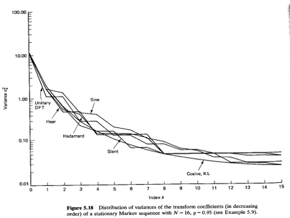
]
- décomposition en variables aléatoires décorrélées
- compaction d'énergie sur des signaux réels ➔ suppression des hautes fréquences 

[*source*](http://www.ee.columbia.edu/~xlx/ee4830/)

---
class: content-centered
# Quantification

- C'est juste un arrondi 
- Premiers vecteurs plus forts
- Derniers vecteurs plus faibles
- Suppression des faibles
- Suppression de ceux jugés (empiriquement) inutile
- Table de quantification différentes selon les algos
- Table stockée dans le JPG
- Lossy

---
class: content-centered
# Compression des zéros

- Vecteurs supprimés = coefficient à zero
- Redondance de zero
- Encode le nombre de zeros pour gagner de la place

---
class: content-centered
# Fin du bloc

- 64px en rgb
- 64px en YCbCr
- Subsampling, merging de pixels
- Somme de vecteurs
- Quantization (œil humain)
- Compression de zeros

Pour chaque bloc.

---
class: content-centered
# Blocs proches

.center[
  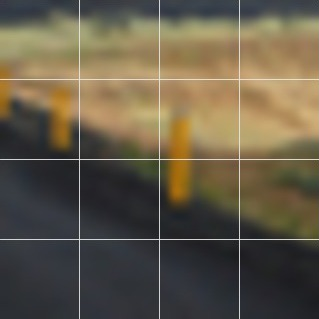
]

- 8x8 c'est petit
- Blocs proches ont une teinte proche
- On définit le vecteur principal d'un bloc par le delta par rapport au bloc
  précédent

---
class: content-centered
# Huffmann coding

- Image complete
- Recherche de redondance
- Compression par patterns, dictionnaire, symboles

---
class: content-centered
# Conclusion

- Image = Somme des blocs
- Bloc = Somme des pixels
- Reversible
- Mix lossless et lossy
- Implémentations différentes par outil
- Lecture normale ou progressive

---
class: full-page, slide-metadata
# Metadatas

---
class: content-centered
# Trois formats

// TODO : un output d'exiftool

- Exif
- IPTC
- XMP

---
class: content-centered
# EXIF (1995)

- **EX**changeable **I**mage **F**ile
- Lors de la prise de photo
- Informations techniques
- 64kb max, no UTF-8, no timezone

---
class: content-centered
# IPTC (1990)

.center[
  
]

 

- **I**nternational **P**ress **T**elecommunications **C**ouncil
- **I**nformation **I**nterchange **M**odel
- Texte, audio, video, images, etc
- Auteur, copyright, description, etc
- Deprecated

---
class: content-centered
# XMP (2001)

.center[
  
]

 

- e**X**tensible **M**etadata **P**latform
- EXIF + IPTC en XML
- Extensible, UTF-8, i18n
- Support faible

---
class: content-centered
# Fragmentation

- Info dupliquée
- Reconciliation
- Support limité
- Tags propriétaires

---
class: content-centered
# Compression

- Suppression aggressive
- Garder auteur, license

 

```shell
jpegtran -optimize -copy none file.jpg
```

---
class: full-page, slide-tools
# Outils

---
class: content-centered
# Outils

// TODO ajouter ces outils directement au fil de la présentation ?

- jpegoptim -m80 --strip-all
- cjpeg-dssim jpegoptim

---
class: content-centered
# Le futur du JPEG ?
- Les successeurs : JPEG 2000 (so last century), wavelets compression, multiresolution tiling...

- Le JPEG est largement suffisant
- Le gain des méthodes plus avancées est trop faible
- Ouvert et gratuit (les brevets sont valables 20 ans)

---
class: content-centered
# Good is enough

- Côté vidéo le besoin a encouragé les avancées (H.264, H.265)
- Les principaux gains liés à notre perception ont majoritairement été exploités (audio, vidéo, image...)
- DVD Audio, HD audio, 4K sont souvent plutôt des besoins marketing que véritablement avérés

---
## Sources

http://www.impulseadventure.com/photo/jpeg-compression.html
http://fr.wikipedia.org/wiki/JPEG#D.C3.A9coupage_en_blocs
http://fr.wikipedia.org/wiki/Codage_de_Huffman
http://en.wikipedia.org/wiki/File:JPEG_process.svg
http://www.ams.org/samplings/feature-column/fcarc-image-compression
http://upload.wikimedia.org/wikipedia/commons/2/23/Dctjpeg.png

Bec Brown : http://finda.photo/image/6954
Taylor Swayze : http://finda.photo/image/8420
Ariana Prestes : http://finda.photo/image/4937
http://en.wikipedia.org/wiki/Autopsy#/media/File:Rembrandt_Harmensz._van_Rijn_007.jpg


