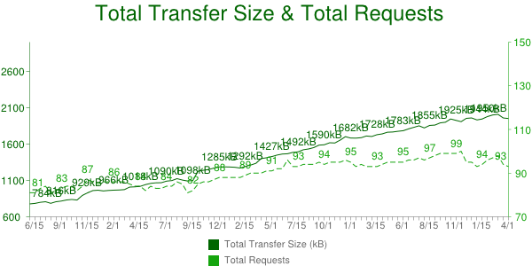
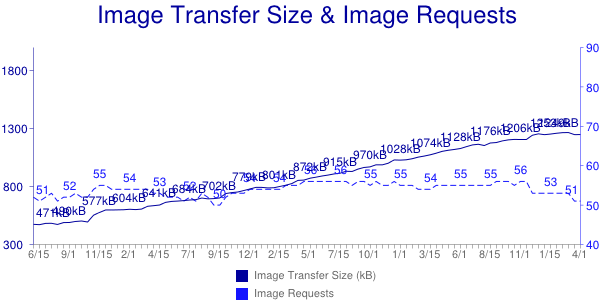

class: full-page, slide-intro
# Anatomie d'un JPG
---
class: content-centered
# Why a talk about JPEG ?
- Webperf is a hot topic for us
- JPEG comes from the 90's
- Still widely used today

---
class: content-centered
# JPEG : historique
- **J**oint **P**hotographic **E**xperts **G**roup produced the standard *Information technology – Digital compression and coding of continuous-tone still images*
- Started in 1986, published in 1992 (approved by ISO and ITU)
- Image compression method
- File format: **J**peg **F**ile **I**nterchange **F**ormat (JFIF)

---
class: content-centered
# More than half of the page payload today
.center[
  
  
]
- 

---
class: content-centered
# Sommaire

- Compression
- Metadatas
- Outils

---
class: content-centered
# Compression

.center[
  
]

---
class: content-centered
# Mode naïf

- 400x268 = 107 200px
- 1px = RGB(0-255, 0-255, 0-255)
- 1px = 3 bytes
- 107 200px = 321 600 bytes
- Taille réelle: 111 858 bytes
- Taille compressée: 9 412 bytes

---
class: content-centered
# Une combinaison de méthodes

- Compression sans perte (*lossless*)
-- Techniques issues de la théorie de l'information (Shannon, 1948)
--- Huffman Coding
--- Differential coding
-- Techniques d'algèbre linéaire
--- Karhunen Loève Transform (KLT)
--- Discrete Cosine Transform
- Compression avec perte (*lossy*)
-- Techniques psychovisuelles
--- RGB --> YCrCb
--- Quantification empirique

- Changement d'unités
- Faiblesse de l'œil humain
- Zip classique
- Recherche de redondances

---
class: content-centered
# Bloc de 8x8

// TODO: Notre image découpée en blocs de 8x8

- Padding avec du blanc
- Compression sur chaque bloc
- Puis regroupage
- Artefacts visibles à l'œil nu sur les blocs

---
class: content-centered
# Un bloc

- 8x8 c'est petit
- Chaque pixel est quasi-identique à son voisin
- Aplats de couleur fréquents sur les photos
- Chaque bloc a une teinte dominante
- Redondance de teinte

---
class: content-centered
# RGB -> YCbCr

- Changement d'unité RGB -> YCbCr
- Lossless
- Deux couleurs proches
  - R + G + B changent
  - Seul Y change. G et B restent identiques ou très proches.
- Redondance Cb/Cr.

// TODO: Exemples de couleurs proches avec équivalents RGB et équivalents YCbCR

---
class: content-centered
# Subsampling

- Pixels cote-à-cote, même Cb/Cr
- Merger les pixels. 2 par 2, 4 par 4, par ligne, par colonne
- Moins de valeurs à stocker
- Lossy

// Example d'une même image subsamplée différemment pour montrer la différence
de teinte ?

---
class: content-centered
# DCT

- Sur un bloc complet
- Dur à expliquer, partie la plus couteuse en CPU
- Changement d'unité
- 64 pixels deviennent une somme de 64 vecteurs
- Chaque vecteur est coefficienté
- Chaque bloc possède donc un hash unique
- Quasi-lossless (arrondis)

---
class: content-centered
# Quantification

- Premiers vecteurs plus forts
- Derniers vecteurs plus faibles
- Suppression des faibles
- Suppression de ceux jugés (empiriquement) inutile
- Table de quantification différentes selon les algos
- Table stockée dans le JPG
- Lossy

---
class: content-centered
# Compression des zéros

- Vecteurs supprimés = coefficient à zero
- Redondance de zero
- Encode le nombre de zeros pour gagner de la place

---
class: content-centered
# Fin du bloc

- 64px en rgb
- 64px en YCbCr
- Subsampling, merging de pixels
- Somme de vecteurs
- Quantization (œil humain)
- Compression de zeros

Pour chaque bloc.

---
class: content-centered
# Blocs proches

- 8x8 c'est petit
- Blocs proches ont une teinte proche
- On définit le vecteur principal d'un bloc par le delta par rapport au bloc
  précédent

---
class: content-centered
# Huffmann coding

- Image complete
- Recherche de redondance
- Compression par patterns, dictionnaire, symboles

---
class: content-centered
# Conclusion

- Image = Somme des blocs
- Bloc = Somme des pixels
- Reversible
- Mix lossless et lossy
- Implémentations différentes par outil
- Lecture normale ou progressive

---
class: full-page, slide-metadata
# Metadatas

---
class: content-centered
# Trois formats

- Exif
- IPTC
- XMP

---
class: content-centered
# EXIF

- Infos techniques sur la photo
- Flash, resolution, iso
- Marque de l'appareil
- Thumbnail
- Whitelist

---
class: content-centered
# IPTC

- Informations subjectives
- Auteur, description, license
- Whitelist partagée entre images, audio, video

---
class: content-centered
# XMP

- XML
- UTF8
- Multilangue
- Tags standards (Dublin Core)
- Extensible (trop?)

---
class: content-centered
# Fragmentation

- Info dupliquée 3 fois
- Info potentiellement différente 3 fois
- Support limité de XMP
- Tags propriétaires

---
class: content-centered
# Compression

- Reconciliation
- Suppression aggressive

---
class: full-page, slide-tools
# Outils

---
class: content-centered
# Outils

- exiftool
- jpegtran -optimize copy none
- jpegoptim -m80 --strip-all
- cjpeg-dssim jpegoptim

---
## Sources

http://www.impulseadventure.com/photo/jpeg-compression.html
http://fr.wikipedia.org/wiki/JPEG#D.C3.A9coupage_en_blocs
http://fr.wikipedia.org/wiki/Codage_de_Huffman
http://www.ams.org/samplings/feature-column/fcarc-image-compression
http://upload.wikimedia.org/wikipedia/commons/2/23/Dctjpeg.png

Bec Brown : http://finda.photo/image/6954
Taylor Swayze : http://finda.photo/image/8420
Ariana Prestes : http://finda.photo/image/4937

